# PatternMind 324111

**Team Members:**

- Silvia Monteleone (315221)
- Riccardo Palleschi (319401)
- Simone Prezioso (324111)

## Section 1: Introduction

This project explores visual concept organization in the PatternMind dataset, which contains 25,557 images distributed across 233 categories. Our primary objective is understanding and organization rather than maximizing classification accuracy: we aim to uncover patterns, clusters, and relationships among visual categories in feature space.

Our framework proceeds in four stages. First, we train a custom CNN to extract 256-dimensional feature embeddings that capture the visual essence of each image. Second, we apply PCA for dimensionality reduction, retaining 85% of variance in 50 components. Third, we use hierarchical clustering on category centroids to discover data-driven macro-categories that reveal natural visual themes without predefined semantic labels. Finally, we evaluate K-Means clustering against both fine-grained (233) and macro-category labels using Purity, ARI, and NMI metrics to assess unsupervised organization quality at different granularities.

To establish performance baselines, we also compare three supervised classifiers (Logistic Regression, SVM, and Random Forest) on the learned features. Our key findings demonstrate that CNN features encode meaningful visual structure: hierarchical clustering reveals coherent groupings such as space objects (saturn, mars, comet), birds (duck, goose, hummingbird), and vehicles, while simple linear classifiers achieve 40.9% accuracy on 233 classes, far above the 0.43% random baseline.

## Section 2: Methods

### 2.1 Environment Setup

To recreate the environment use Python's built-in venv module and pip for dependencies:

```bash
python3 -m venv .venv
source .venv/bin/activate
pip install -r requirements.txt
```

### 2.2 Data Loading and Preprocessing

Images are loaded from the dataset directory where each subfolder represents a distinct category. We create a DataFrame containing the file path, category name, and numeric label for each image. The dataset contains 25,557 total images across 233 categories, with an average of approximately 110 images per category. However, there is significant class imbalance, with a ratio of 10.57x between the most and least frequent categories.

### 2.3 CNN Architecture

We design a custom CNN with three convolutional blocks to extract visual features. The first block uses 32 filters across 2 layers with 3x3 kernels, SAME padding, and L2 regularization (1e-4) to detect low-level features like edges and colors. The second block increases to 64 filters with the same configuration plus Dropout (0.25) to detect mid-level features such as textures and patterns. The third block uses 128 filters to detect high-level features including shapes and object parts. After the convolutional blocks, GlobalAveragePooling aggregates spatial features, followed by a Dense layer with 256 neurons (ReLU activation, L2 regularization, Dropout 0.5) that produces the compact representation used for clustering. The output layer contains 233 neurons with softmax activation for classification.

Key design choices include ReLU activation throughout, padding="same" to preserve spatial dimensions, MaxPooling to halve spatial dimensions in each block, batch size of 32, Adam optimizer with learning rate 0.0005, and categorical crossentropy loss. We use early stopping on validation loss with patience 5 and ReduceLROnPlateau with factor 0.5 and patience 3.

### 2.4 Data Augmentation

To address image variability, we apply random horizontal flips, rotations (plus or minus 0.2 rad), zoom (plus or minus 20%), translations (plus or minus 15% height/width), contrast adjustments (plus or minus 20%), and brightness variations (plus or minus 20%) during training.

### 2.5 Dimensionality Reduction

We use Principal Component Analysis (PCA) to reduce the 256-dimensional CNN features. Features are first standardized to zero mean and unit variance. We retain 50 components that capture 85.06% of the total variance, while 2D projections capturing approximately 16% variance are used for visualization purposes.

### 2.6 Clustering Approaches

Hierarchical clustering is applied to 233 category centroids using Ward linkage, which minimizes within-cluster variance at each merge step. This reveals data-driven macro-categories at different granularities. K-Means clustering partitions images into k clusters by minimizing within-cluster variance, evaluated with k in {10, 20, 50, 100, 233}.

## Section 3: Experimental Design

### 3.1 Experiment 1: CNN Feature Learning

The purpose of this experiment is to train a CNN to learn discriminative visual features that capture the essence of each image category. The baseline is random classification, which would achieve only 1/233 = 0.43% accuracy. We evaluate performance using training and validation accuracy, training and validation loss, with early stopping triggered by validation loss.

### 3.2 Experiment 2: Supervised Classification Comparison

This experiment establishes an upper bound for classification performance using the learned CNN features and compares multiple classifiers. We test Logistic Regression with different regularization strengths (C=1.0 and C=0.1), Logistic Regression with class balancing, Logistic Regression on PCA-reduced features (50D), Support Vector Machine with RBF kernel, and Random Forest. Evaluation metrics include test accuracy, Macro F1-score (which treats all classes equally), Weighted F1-score (which accounts for class imbalance), 5-fold cross-validation for robust estimates, and paired t-tests for statistical significance.

### 3.3 Experiment 3: Macro-Category Classification

The purpose is to validate that hierarchically-derived macro-categories represent meaningful visual groupings. The baseline is fine-grained 233-class classification achieving 40.9% accuracy. We measure test accuracy at different granularities (5, 10, 15, 20, and 30 macro-categories) and compare to the random baseline at each granularity level.

### 3.4 Experiment 4: K-Means Clustering Evaluation

This experiment assesses how well unsupervised K-Means clustering aligns with both fine-grained categories and hierarchically-derived macro-categories. Baselines include random cluster assignment and hierarchical clustering structure. We use three complementary evaluation metrics: Purity measures cluster homogeneity as the fraction of correctly assigned samples; Adjusted Rand Index (ARI) corrects for chance agreement where ARI=0 means random clustering and ARI>0 indicates real structure; Normalized Mutual Information (NMI) quantifies information overlap between clusters and true categories.

## Section 4: Results

### 4.1 Dataset Overview

The bar chart below reveals significant class imbalance in the dataset. The most frequent category ("clutter") has 761 images while the least frequent category ("top-hat") has only 72 images, representing a 10x variation in class sizes.

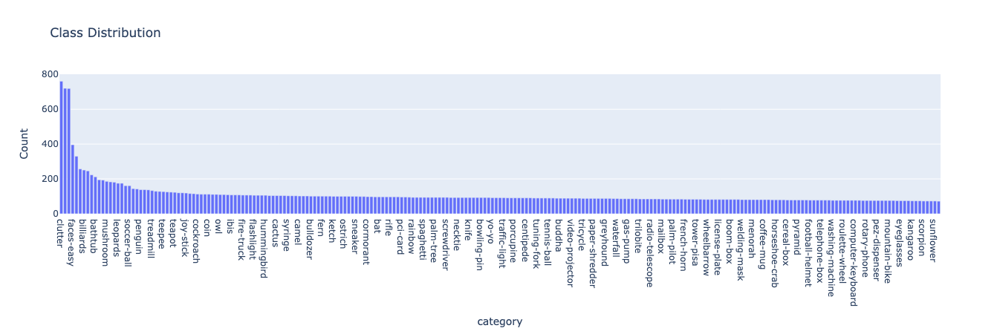

Image dimensions vary considerably across the dataset, with most widths and heights concentrated around 200-400 pixels. We standardize all images to 224x224 for CNN input.

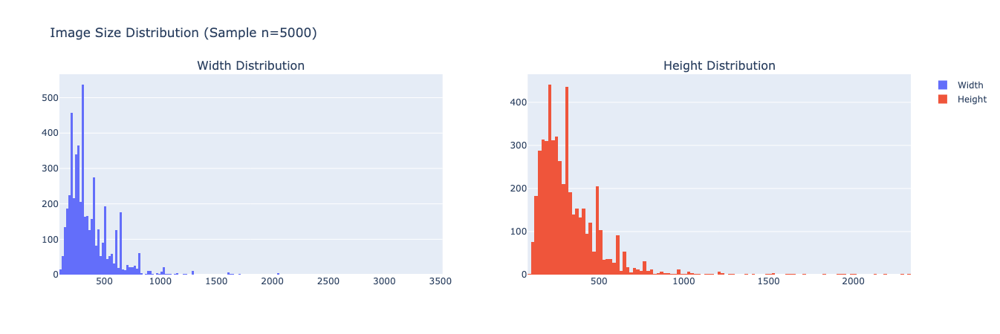

Random samples from the dataset reveal substantial visual diversity within and across categories, highlighting the challenges our models face in learning discriminative features.

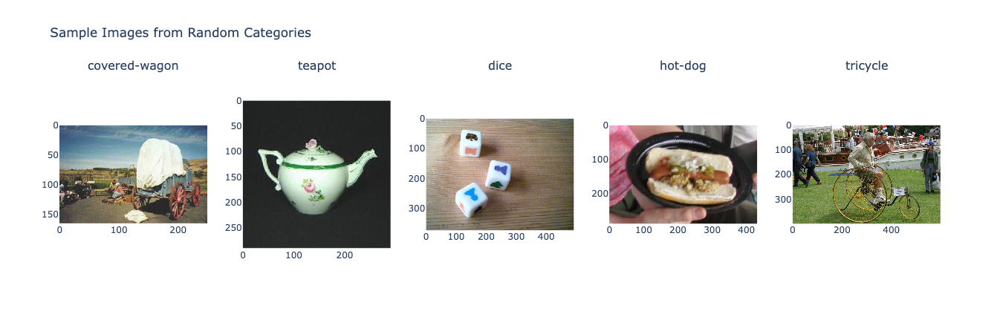

### 4.2 CNN Training Results

The training history shows the model's progression over 38 epochs before early stopping triggered. The best validation loss of 3.41 occurred at epoch 33, and the weights from that epoch were restored.

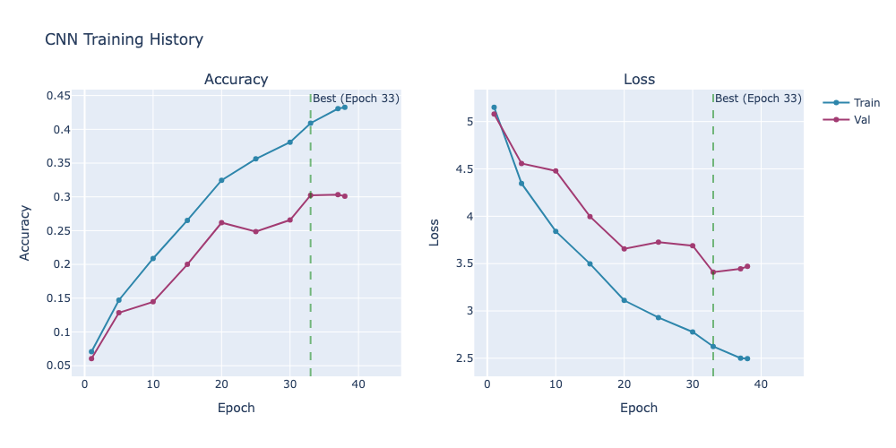

| Epoch | Accuracy | Loss  | Val Accuracy | Val Loss | Learning Rate |
| ----- | -------- | ----- | ------------ | -------- | ------------- |
| 1     | 7.09%    | 5.151 | 6.05%        | 5.081    | 0.00050       |
| 5     | 14.71%   | 4.347 | 12.85%       | 4.558    | 0.00050       |
| 10    | 20.88%   | 3.841 | 14.46%       | 4.479    | 0.00050       |
| 15    | 26.52%   | 3.498 | 20.00%       | 3.997    | 0.00050       |
| 20    | 32.46%   | 3.111 | 26.18%       | 3.656    | 0.00025       |
| 25    | 35.62%   | 2.930 | 24.87%       | 3.726    | 0.00025       |
| 30    | 38.10%   | 2.778 | 26.57%       | 3.689    | 0.00025       |
| 33    | 40.91%   | 2.624 | 30.23%       | 3.409    | 0.000125      |
| 37    | 43.06%   | 2.501 | 30.33%       | 3.445    | 0.0000625     |
| 38    | 43.26%   | 2.496 | 30.09%       | 3.470    | 0.0000625     |

The model achieved 30.3% validation accuracy at its best epoch, far above the 0.43% random baseline. This indicates that the CNN learned meaningful visual representations suitable for downstream clustering tasks.

### 4.3 PCA and Visualization

The cumulative explained variance plot shows how variance is distributed across principal components. The first 10 components capture over half the variance (50.51%), while 50 components retain 85.06% of the information.

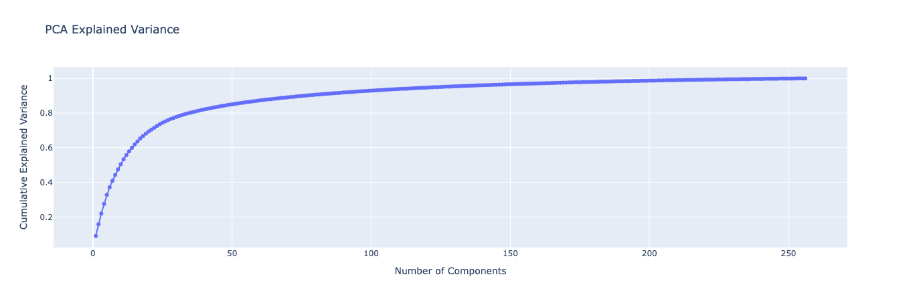

| Components | Variance Explained |
| ---------- | ------------------ |
| First 2    | 15.82%             |
| First 10   | 50.51%             |
| First 50   | 85.06%             |
| First 100  | 92.95%             |

The 2D PCA projection visualizes how semantically distinct categories separate in feature space. Airplanes form a tight cluster in the upper-left region, while space-related categories (mars, saturn) occupy the center with substantial overlap, reflecting their shared visual characteristics. Birds (duck, goose) cluster together in the right portion of the plot.

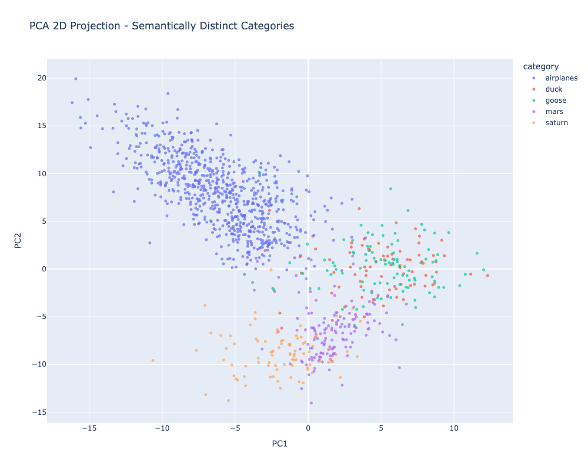

### 4.4 Hierarchical Clustering

The dendrogram reveals how the 233 categories naturally group into larger visual families. By cutting at different heights, we can create different numbers of macro-categories: cutting at 50% of maximum height gives 6 broad groups, while cutting at 30% gives 19 smaller clusters.

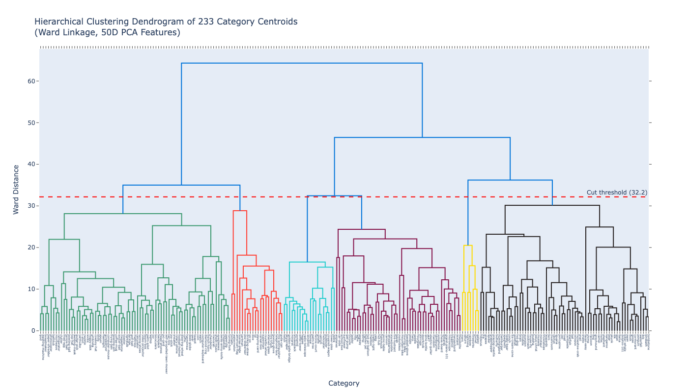

Notable macro-categories include space objects (comet, fireworks, galaxy, lightning, mars, rainbow, saturn) which share radial patterns and glowing effects, and organic subjects (butterfly, grapes, grasshopper, hibiscus, hummingbird) which share detailed patterns and bright colors. However, some clusters reveal the CNN's reliance on visual similarity over semantics, grouping conch shells, hamburgers, and teddy bears based on rounded shapes and warm colors.

The heatmap shows pairwise Euclidean distances between category centroids, reordered according to hierarchical clustering. Block structures along the diagonal indicate groups of categories with low inter-category distances.

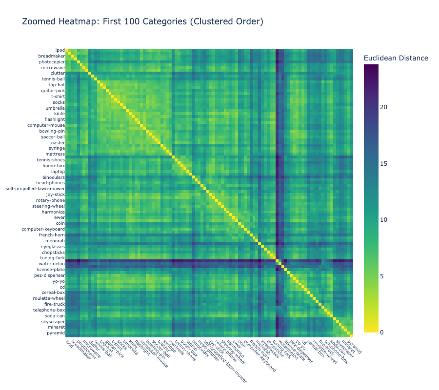

### 4.5 Supervised Classification Results

We compared multiple Logistic Regression configurations to find the optimal balance between fitting and generalization.

| Configuration    | Train Acc | Test Acc  | Gap   | Macro F1  | Weighted F1 |
| ---------------- | --------- | --------- | ----- | --------- | ----------- |
| Baseline (C=1.0) | 80.7%     | 37.7%     | 43.0% | 31.6%     | 37.3%       |
| **C=0.1**        | 63.8%     | **40.9%** | 22.9% | **33.8%** | **39.4%**   |
| C=0.1 + balanced | 63.9%     | 39.2%     | 24.7% | 33.3%     | 38.7%       |
| PCA-50D + C=0.1  | 46.7%     | 39.2%     | 7.5%  | 31.5%     | 37.1%       |

The best model is Logistic Regression with C=0.1, achieving 40.9% test accuracy. The 5-fold cross-validation confirms robustness with a mean test accuracy of 40.42% plus or minus 0.39%.

| Metric         | Mean   | Std Dev              |
| -------------- | ------ | -------------------- |
| Train Accuracy | 0.6375 | plus or minus 0.0032 |
| Test Accuracy  | 0.4042 | plus or minus 0.0039 |
| Macro F1       | 0.3356 | plus or minus 0.0033 |
| Weighted F1    | 0.3893 | plus or minus 0.0041 |

The distribution of per-class accuracy shows dramatic variation. Categories like car-side and leopards achieve perfect 100% classification, while categories like windmill and tuning-fork achieve 0% accuracy.

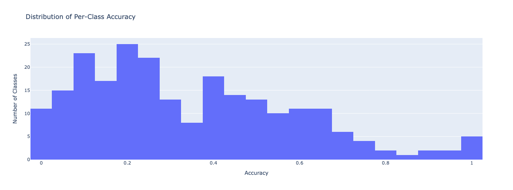

| Best Categories | Accuracy | Worst Categories | Accuracy |
| --------------- | -------- | ---------------- | -------- |
| car-side        | 100.0%   | windmill         | 0%       |
| leopards        | 100.0%   | tuning-fork      | 0%       |
| faces-easy      | 98.7%    | rifle            | 0%       |
| motorbikes      | 98.6%    | dog              | 0%       |
| airplanes       | 97.9%    | mailbox          | 0%       |

The confusion matrix for the top 30 most frequent categories reveals that objects photographed against busy backgrounds frequently get misclassified as "clutter." The dominant error pattern shows ladder to clutter at 26.3% and t-shirt to clutter at 10.5%.

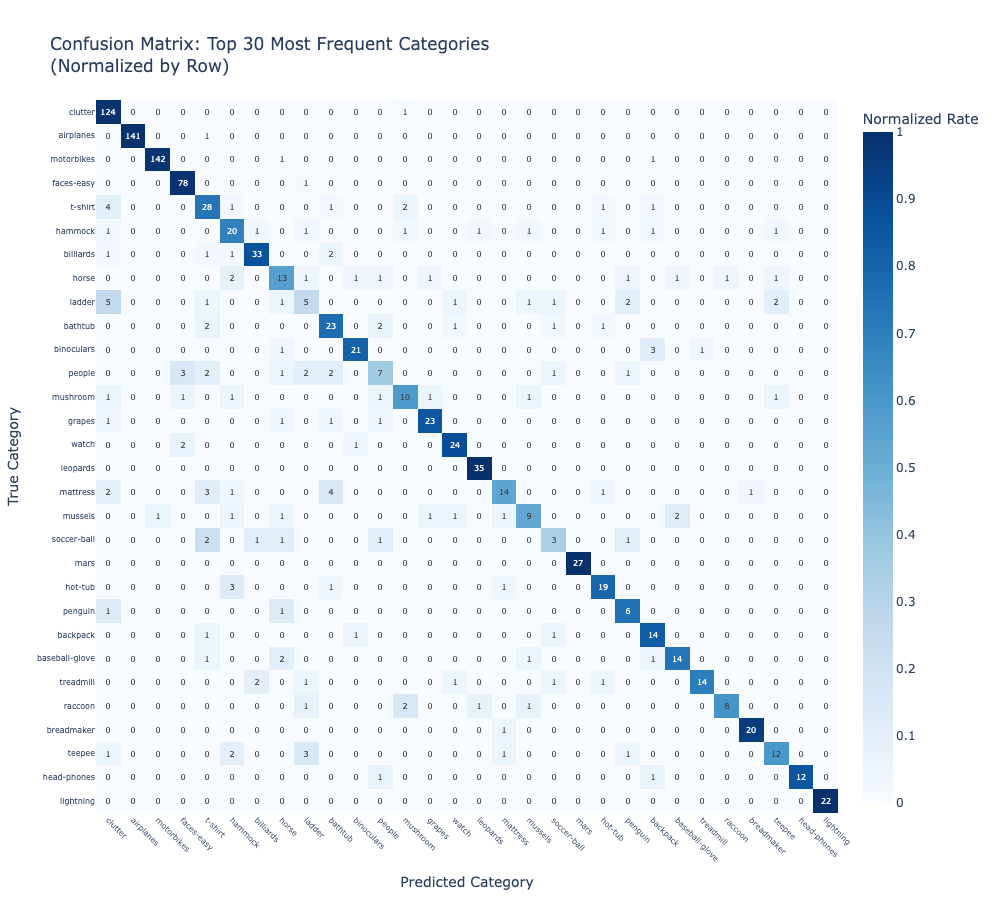

### 4.6 Macro-Category Classification

Training Logistic Regression on hierarchically-derived macro-categories instead of fine-grained labels validates that these groupings represent meaningful visual concepts.

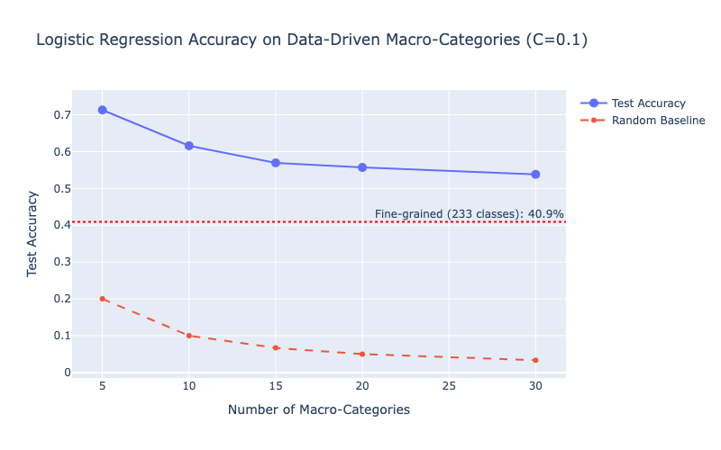

| Macro-Categories | Test Accuracy | Random Baseline |
| ---------------- | ------------- | --------------- |
| 5                | 72.0%         | 20.0%           |
| 10               | 63.5%         | 10.0%           |
| 15               | 58.2%         | 6.7%            |
| 20               | 55.1%         | 5.0%            |
| 30               | 54.0%         | 3.3%            |

Classification accuracy jumped to 72% when using 5 macro-categories instead of 233 fine-grained labels, validating that our hierarchical groupings capture real visual coherence.

### 4.7 Classifier Comparison

We compared Logistic Regression against SVM (RBF kernel) and Random Forest to understand which classifier works best with CNN features.

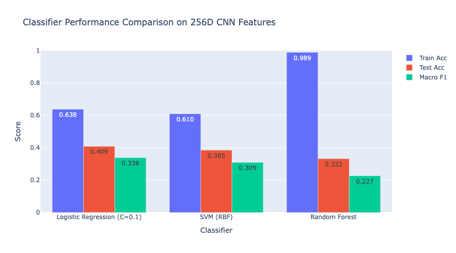

| Classifier                      | Train Acc | Test Acc  | Macro F1  |
| ------------------------------- | --------- | --------- | --------- |
| **Logistic Regression (C=0.1)** | 63.8%     | **40.9%** | **33.8%** |
| SVM (RBF)                       | 61.0%     | 38.5%     | 30.9%     |
| Random Forest                   | 98.9%     | 33.2%     | 22.7%     |

Logistic Regression outperformed more complex models. This makes sense because the CNN already learned the necessary non-linear transformations, so downstream classifiers benefit more from regularization than from additional model complexity. Random Forest shows dramatic overfitting with 98.9% training accuracy but only 33.2% test accuracy.

Paired t-tests across 10 random seeds confirm all performance differences are statistically significant (p < 0.001). The low standard deviations across all methods (less than 0.6%) indicate stable, reproducible results.

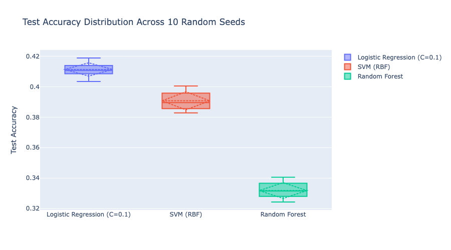

### 4.8 K-Means Clustering Evaluation

The three heatmaps show Purity, ARI, and NMI across all combinations of K-Means clusters (10, 20, 50, 100, 233) and target category granularities (5, 10, 15, 20, 30 macro-categories, plus the original 233 fine-grained categories).

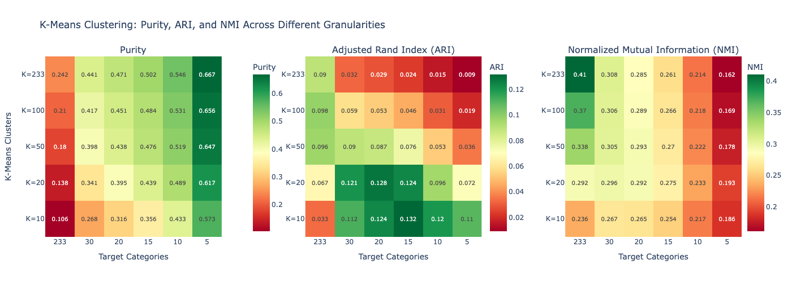

| K-Means Clusters | Target Categories | Purity | ARI   | NMI   |
| ---------------- | ----------------- | ------ | ----- | ----- |
| K=233            | 5 macro           | 66.7%  | 0.127 | 0.163 |
| K=100            | 5 macro           | 62.4%  | 0.121 | 0.160 |
| K=50             | 5 macro           | 57.3%  | 0.113 | 0.154 |
| K=233            | 233 fine-grained  | 18.8%  | 0.087 | 0.408 |

Purity increases from 10.6% (K=10, 233 categories) to 66.7% (K=233, 5 macro-categories), following a diagonal pattern where more clusters or fewer target groups improve the metric. However, purity has a built-in bias that makes it look better as K increases. The ARI heatmap tells a more honest story, with best scores (around 0.12-0.13) appearing in the middle range around 10-20 macro-categories. Against the original 233 fine-grained categories, ARI stays below 0.10 for all K values, confirming that K-Means cannot recover detailed distinctions.

K-Means achieved 57-67% purity on broad categories but struggled with fine-grained distinctions (ARI less than 0.10 for 233 classes). For practical applications, this means K-Means on CNN features is useful for organizing images into general groups, but supervised learning is needed for distinguishing specific categories.

## Section 5: Conclusions

### Summary of Findings

This project demonstrates that CNN features combined with hierarchical clustering can effectively organize large image collections without exhaustive labeling. Our CNN achieved 30.3% validation accuracy on 233 classes, which is modest but sufficient to learn meaningful visual representations. The 256-dimensional embeddings capture genuine similarity: space objects cluster by radial patterns and glowing effects, birds group by feather textures and body shapes, and vehicles form coherent structural clusters.

Supervised classification confirms the features are discriminative. Logistic Regression achieved 40.9% test accuracy, outperforming SVM (38.5%) and Random Forest (33.2%). The CNN already learned the necessary non-linear transformations, so simple regularized classifiers work best. When classifying into 5 macro-categories instead of 233 fine-grained labels, accuracy jumped to 72%, validating that our hierarchical groupings capture real visual coherence. K-Means clustering achieved 57-67% purity on broad categories but struggled with fine-grained distinctions (ARI less than 0.10 for 233 classes). Unsupervised methods work well for coarse organization but cannot replace supervised learning for detailed categorization.

### Limitations and Future Work

Three main limitations constrain this work. First, our CNN is shallow compared to ResNet or EfficientNet, and we trained from scratch rather than using ImageNet pretrained weights. This was intentional, to see what patterns a CNN learns from our data alone, but limits feature quality. Second, our evaluation metrics assume ground-truth labels are correct, yet PatternMind categories mix semantic concepts with visual properties inconsistently. The "clutter" category exemplifies this problem: it contains images of messy, disorganized scenes, but objects photographed against busy backgrounds (ladders, t-shirts) frequently get misclassified as clutter. The CNN cannot distinguish between an inherently cluttered scene and a clean object in a cluttered context, as both produce similar visual features. This label ambiguity propagates through our entire evaluation pipeline. Third, CNN features optimized for classification do not form geometrically compact clusters, causing substantial overlap between categories in feature space.

Two directions would most improve this work. Transfer learning with a pretrained backbone (ResNet-50 or Vision Transformer) would yield stronger features while cutting training time from 5 hours to under 30 minutes. Multimodal embeddings combining visual features with text descriptions could resolve ambiguity zones where visually similar but semantically unrelated items cluster together, such as conch shells with hamburgers based on warm colors and rounded shapes.
